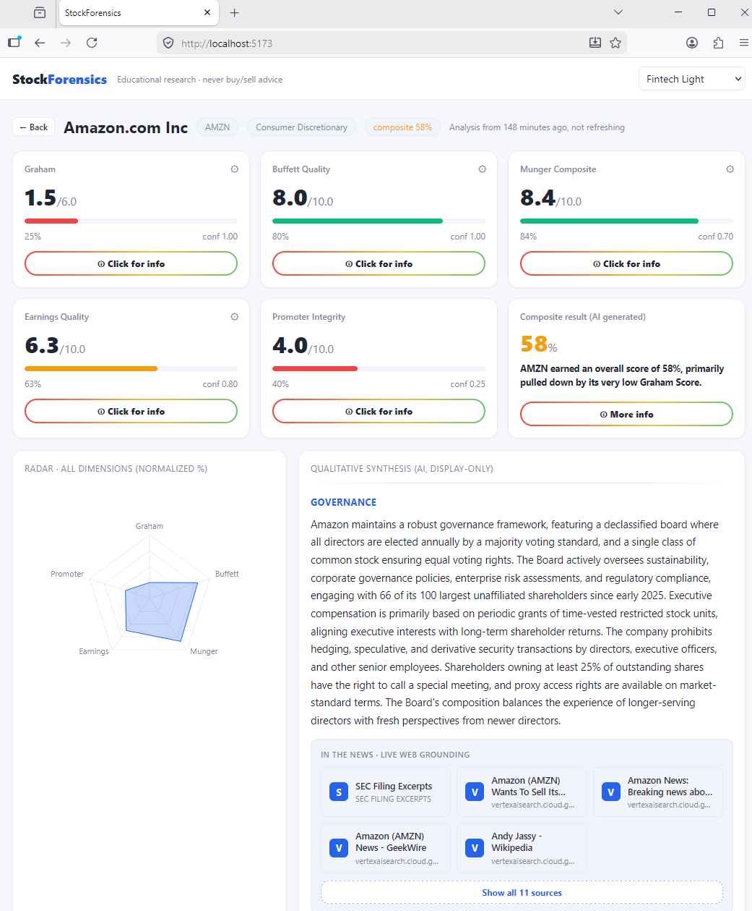

# StockForensics

Value-investing analysis over the top 10 S&P 500 companies. Computes Graham,
Buffett Quality, Munger Composite, Earnings Quality and (hybrid) Promoter
Integrity scores **deterministically in code**. An LLM supplies only qualitative
narrative + structured promoter evidence that code then thresholds. **Never says
buy/sell. Educational research only.**

Hosted as a Streamlit Cloud / Hugging Face Spaces app. The scoring engine is
imported directly into the Streamlit script with no HTTP layer. See `plan.md`
for the full design and decision log.

---

## Screenshots

### Stock picker and score cards



### Score breakdowns

| | |
|---|---|
|  |  |
|  |  |
|  |  |
|  |  |

---

## What the AI does (bounded, live, streamed)

Deterministic scores need no AI and load immediately from the database. When you
**select one stock**, the AI runs lazily and up-to-the-minute:

1. RAG-retrieves the most relevant passages from SEC 10-K and DEF 14A filings
2. Calls `gemini-2.5-flash` with `google_search` grounding for fresh governance news
3. Returns a qualitative narrative + structured promoter findings (JSON contract)
4. Code applies every threshold and computes the final Promoter Integrity score
5. A second Gemini call (no web search) explains the overall composite score

The model's own **thought summaries stream live** to the "AI Agent Analysis &
Thinking" panel as it reasons. Code applies every threshold and every weighted
sum; the LLM never computes a financial figure (rule #10 of the design). Promoter
Integrity is finalised live on first selection and cached for 4 hours.

---

## Architecture

```
streamlit_app.py  (Streamlit, no HTTP layer)
  _boot_db()          @st.cache_resource: migrate + seed on first load
  _get_adapters()     @st.cache_resource: wire live vs fixture adapters
  main()              UI: auth -> stock picker -> scores -> AI stream

python/app/
  adapters/           SEC EDGAR (httpx), yfinance, Gemini, Pinecone, fixtures
  transform/          Graham / Buffett / Munger / EQ / Promoter scoring engine
  agent/              Gemini prompt builders + JSON contract validator
  pipeline/           runner.py (batch seed) + analyze.py (live stream)
  rag/                chunk.py: split filings into passages
  db/                 SQLite (WAL), SQLAlchemy, seed, repository
  core/               config (pydantic-settings), logging (structlog), clients

data/
  universe/sp500.csv  30-row vendored S&P 500 snapshot (reference)
  stockforensics.db   SQLite (generated at bootstrap)
```

**Startup:** On first load (or after 340 days), `seed_extended()` fetches SEC EDGAR
XBRL fundamentals + yfinance market data for the top-10 and computes scores. No API
key required for this step. Subsequent loads skip seeding and serve from the DB.

**On selection:** Live market refresh (yfinance) + AI synthesis (Gemini). If an AI
result is cached (under 4 hours old), it replays from the DB with a "cached Xh ago"
badge. No manual re-run option; the cache expires automatically after 4 hours.

---

## Run it

```bash
# One-time setup (offline: works with seed data, no API keys needed)
cd python && make bootstrap   # uv venv, deps, hooks, .env, DB, seed
make test                     # offline gate: 71 tests, 80% coverage target

# Dev: run Streamlit on localhost:8501
cd ..
streamlit run streamlit_app.py
```

Paste API keys into `python/.env` when ready:

| Key | Required for |
|-----|-------------|
| `GEMINI_API_KEY` | AI analysis (narrative, promoter evidence, composite rationale) |
| `PINECONE_API_KEY` | RAG vector store for filing retrieval |
| `SEC_USER_AGENT` | SEC EDGAR fetches (email address, not secret) |
| `API_KEY` | Streamlit auth gate (empty = dev mode, any key passes) |

Missing keys degrade gracefully: deterministic scores + SEC data still work;
LLM and Pinecone stages skip. On Hugging Face Spaces, add keys as Space secrets.

---

## The 5 scores

| Dimension | Range | Source |
|-----------|-------|--------|
| Graham | 0-7 | SEC EDGAR: P/E, P/B, current ratio, D/E, EPS, dividend, EPS growth |
| Buffett Quality | 0-10 | SEC EDGAR: ROE consistency, margin trends, FCF, revenue growth |
| Munger Composite | 0-10 | SEC EDGAR: quality (ROE/gross margin) + value (sector-relative P/E, P/B) + capital efficiency |
| Earnings Quality | 0-10 | SEC EDGAR: OCF vs net income, accruals, margin stability, goodwill, audit signals |
| Promoter Integrity | 0-10 | HYBRID: SEC EDGAR (ownership, insider selling) + LLM via live web search (CEO tenure, SEC enforcement, governance) |

Every criterion is PASS / FAIL / NA. Missing data window-degrades (uses available
years) or NA-drops and weights renormalise. The 5-dim composite (simple average)
appears in the "AI Overall Score" card.

---

## UI panels

### Score cards

Two rows of three cards. Row 1: Graham, Buffett Quality, Munger Composite.
Row 2: Earnings Quality, Promoter Integrity, AI Overall Score.

Each scored card has a **More info** button (4-colour gradient border) that opens a
popup with the per-criterion breakdown table. Promoter Integrity shows an informative
"Score pending AI run" message before the AI has been run.

**AI Overall Score** card: simple average of all 5 dimensions. Its More info popup
shows the dimension table + the AI's own reasoning for the overall verdict.

### Weight editor

Collapsed expander above the radar row. Five sliders (0-2, default 1). Shows the
weighted composite live. Excludes a dimension by setting its weight to zero.
Weights renormalise automatically; individual scores are unchanged.

### Radar + AI Composite Analysis

Left (50%): Plotly radar chart across all 5 dimensions (0-100% scale).
Right (50%): AI Composite Analysis panel - truncated preview of the AI's composite
rationale with a More info button for the full text. Shows a pulsing indicator while
the AI is working.

### Qualitative Narrative

Full-width panel below the radar row. Shows the AI's qualitative brief (executive
summary + sections: Business & Moat, Financial Health, Recent Developments, Risks,
Governance). Includes live web citations. Only visible after AI analysis has run.

### AI Agent Analysis & Thinking

Always in the same Streamlit slot to prevent ghost panels when switching stocks.

**While running:** pulsing blue dot on the title. Auto-scrolls the 280px stream box
via a MutationObserver + `#sf-end` anchor (scrollIntoView). Title updates to
"AI Agent Analysis & Thinking - 100% Complete" when the stream finishes.

**After completion:** replays cached stages and thought summaries with a green
"cached Xh Ym ago" badge. No re-run button; re-runs automatically when the 4-hour
cache expires and the stock is next selected.

**During streaming:** the stock selector is disabled with an info banner:
"AI analysis is running for [Company] - stock selection is locked until it completes."

---

## Tests and CI

Offline fixture suite gates coverage (80% target) and CI green. Live adapters are
`make smoke` (non-gating). `python/`: ruff + black + mypy + bandit, all green.

```
71 tests, 0 failures (as of 2026-06-22)
Coverage: ~73% overall (live adapter network lines counted against; gate under review)
```

---

## Key design constraints

- **LLM boundary (rule #10):** LLM never computes a financial figure or sets a
  boolean. It returns structured qualitative evidence; code applies every threshold.
- **Provenance tagging:** every scoring criterion is tagged `CODE` or `LLM-EVIDENCE`
  in the breakdown so the source of each verdict is auditable.
- **No commit/push by AI:** developer verifies and commits. See `plan.md`.
