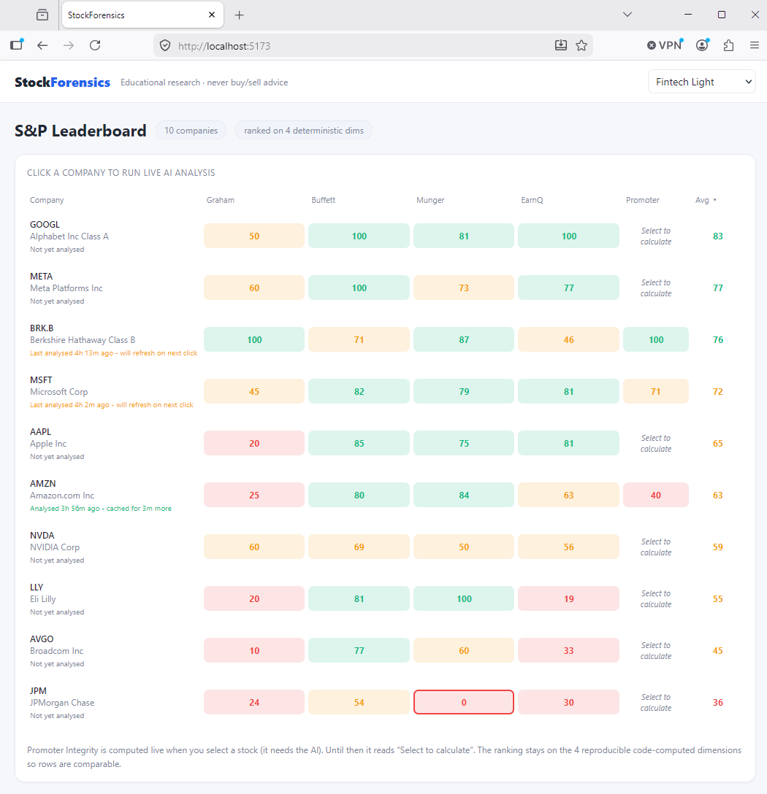

# StockForensics

Value-investing analysis over the top S&P 500 companies. Computes Graham, Buffett,
Munger, Earnings-Quality and (hybrid) Promoter-Integrity scores **deterministically
in code**; an LLM supplies only qualitative narrative + structured promoter evidence
that code then thresholds. **Never says buy/sell; educational research only.**

Hosted as a Hugging Face Streamlit Space. The deterministic scoring pipeline (unchanged)
is imported directly; no HTTP layer. See `plan.md` for the full design and the grilled
decision log.

## Screenshots

### Leaderboard (main screen)



### Single-stock analysis

The per-stock dashboard, its five score breakdowns, the radar, and the live AI panels:


| | |
|---|---|
|  |  |
|  |  |
|  |  |
|  |  |

## What the AI does (bounded, live, streamed)

The deterministic scores need no AI. When you **select one stock**, the AI lazily,
live, and up-to-the-minute: (1) RAG-retrieves the SEC filings, (2) writes a qualitative
narrative (a filings + web brief), (3) extracts promoter governance evidence (with
Gemini `google_search` grounding for fresh web/news), and (4) after code scores the
five dimensions, writes a separate **composite rationale** explaining the overall score
in its own words. The model's own **thought summaries stream** to a "thinking stream"
(SSE) as it reasons. Code applies every threshold and every weighted sum; the LLM never
computes a financial figure (rule #10). Promoter Integrity is finalised live on selection.

## Architecture

```
Python deterministic modules (imported directly)
  transform/  scoring engine: Graham, Buffett, Munger, Earnings Quality, Promoter
  adapters/   SEC EDGAR, yfinance, Gemini, Pinecone, iShares (+offline fixtures)
  agent/      RAG + grounded AI synthesis (Gemini + Google Search)
  pipeline/   batch (deterministic) + live analysis (streamed)
  db/         SQLite (WAL)

Streamlit UI (no HTTP layer)
  leaderboard (st.dataframe): 4 deterministic dims ranked
  company detail: 5-dimension scores, radar chart, narrative + AI
  weight editor (st.slider): renormalise live, no backend
  AI synthesis stream: SSE-style thinking visualised in Streamlit
```

- **Batch** (scheduled): computes the 4 deterministic dims for the universe → leaderboard.
- **On selection** (triggered): live market refresh + AI synthesis, streamed line-by-line.
- **Off-network** (weights): recalculate scores locally with custom weights, no server call.

## Run it

```bash
# One-time setup (offline: works with seed data, no keys)
cd python && make bootstrap          # uv venv, deps, hooks, .env, DB, seed
make test                            # offline gate: 80% coverage, all green

# Dev: run Streamlit on localhost:8501 (hot-reload on save)
streamlit run streamlit_app.py
```

Paste keys into `python/.env` when ready (`GEMINI_API_KEY`, `PINECONE_API_KEY`,
`SEC_USER_AGENT`). Missing keys degrade gracefully: deterministic scores + live SEC
data still work; LLM stages skip. On Hugging Face Spaces, add keys as Space secrets.

## The 5 scores

| Dimension | Range | Source |
|-----------|-------|--------|
| Graham | 0–6 | SEC EDGAR: 6 valuation/safety criteria (dividend excluded; shown separately) |
| Buffett Quality | 0–10 | SEC EDGAR: ROE/margin/FCF consistency |
| Munger Composite | 0–10 | SEC EDGAR: quality / value / capital efficiency |
| Earnings Quality | 0–10 | SEC EDGAR: cash-vs-earnings, accruals, red flags |
| Promoter Integrity | 0–10 | HYBRID: SEC EDGAR (ownership, insider) + LLM (tenure, SEC, criminal, related-party), code-thresholded |

Every criterion is PASS / FAIL / NA; missing data window-degrades or NA-drops and
weights renormalise. Leaderboard ranks on the 4 deterministic dims (comparable);
the full 5-dim composite appears in a stock's detail view.

## Themes

Five user-selectable themes (Fintech Light, SB Minimal, Slate Pro, Swiss Minimal,
Warm Dashboard) built on CSS design tokens; static mockups in `design-samples/`.

## Tests / CI

Offline fixture suite gates coverage (80%) + CI; live adapters are `make smoke`
(non-gating). `python/`: ruff + black + mypy + bandit, all green.
